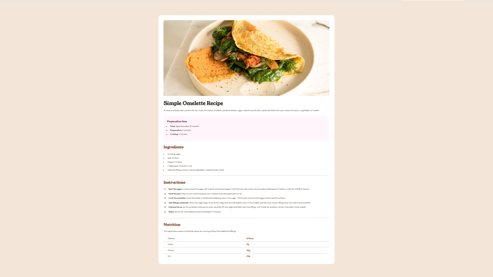

# Frontend Mentor - Recipe page solution

This is a solution to the [Recipe page challenge on Frontend Mentor](https://www.frontendmentor.io/challenges/recipe-page-KiTsR8QQKm). Frontend Mentor challenges help you improve your coding skills by building realistic projects.

## Table of contents

- [Overview](#overview)
- [The challenge](#the-challenge)
- [Screenshot](#screenshot)
  - [Links](#links)
- [My process](#my-process)
  - [Built with](#built-with)
  - [What I learned](#what-i-learned)
  - [Continued development](#continued-development)
  - [Useful resources](#useful-resources)
  - [AI Collaboration](#ai-collaboration)
- [Author](#author)
- [Acknowledgments](#acknowledgments)

### Overview

## The challenge

The project implements the **Recipe page challenge** from Frontend Mentor, a platform that helps developers improve their coding skills by building realistic projects. The goal is to recreate the design of a recipe page using semantic HTML and modern CSS techniques.

## Screenshot

### Links

- Solution URL: [GitHub repository link](https://github.com/whitgunt77/recipe-page)
- Live Site URL: [Deployed/Live site link](https://whitgunt77.github.io/recipe-page/)

## My process

### Built with

- **Semantic HTML5 markup** for clear document structure.
- **CSS custom properties** to manage design tokens and enable easy theming.
- **Flexbox** for responsive layout control.
- **CSS Grid** for precise column alignment.
- **Mobile-first workflow** to ensure optimal display on all devices.

### What I learned

- Applying the **`border-collapse`** property to eliminate unwanted spacing between table columns, as highlighted in community solutions on Stack Overflow.
- Using the **`marker`** CSS property to style list icons, a technique that was new to me and proved essential for matching the design requirements.
- Implementing a **desktop-first workflow** by first designing for larger screens and then adding media queries to adapt the layout for mobile devices.
- Leveraging **Sass** (in some solutions) to streamline repetitive styes and improve code readability.

### Continued development

- Explore **responsive typography** and **dark-mode** implementations to enhance accessibility.
- Experiment with **animation libraries** (e.g., Framer Motion) to add subtle interactive effects.
- Refine **performance optimizations** such as lazy loading images and minimizing CSS/JS bundle sizes.

### Useful resources

- [W3Schools - HTML Reference](https://www.w3schools.com/html/) - helped identify the appropriate tags for each section.
- [Stack Overflow - "border-collapse"](https://stackoverflow.com/questions/tagged/css) - provided community-driven insights on collapsing table borders.
- [MDN - CSS "marker" property](https://developer.mozilla.org/en-US/docs/Web/CSS/::marker) - guided the styling of list markers to match the design.

### AI Collaboration

- I used **ChatGPT** for brainstorming layout strategies and debugging CSS issues.
- **GitHub Copilot** assisted in generating boilerplate code snippets, which I then reviewed and adapted to the project's style guide.
- The AI tools proved valuable for rapid prototyping, though final implementation decisions were made independently to ensure the design fidelity required by the challenge.

## Author

- Website - [Whitney Gunter](https://whitgunt77.github.io/coursera-portfolio-project/)
- Frontend Mentor - [@whitgunt77](https://www.frontendmentor.io/profile/whitgunt77)
- Twitter - [@whitgunt77](https://www.twitter.com/whitgunt77)

## Acknowledgments

Special thanks to the **Frontend Mentor community** for providing the challenge and feedback. Inspiration was drawn from solutions by **DwarakanathAkkala** and **LuciaVerde**, whose approaches to responsive design were particularly insightful.
